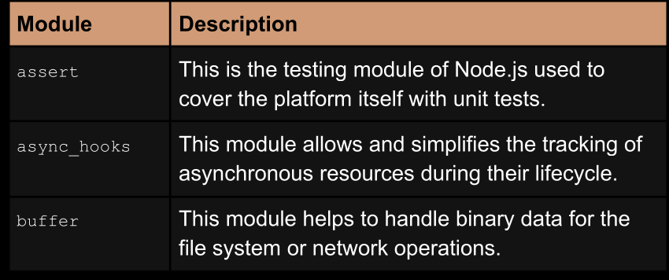
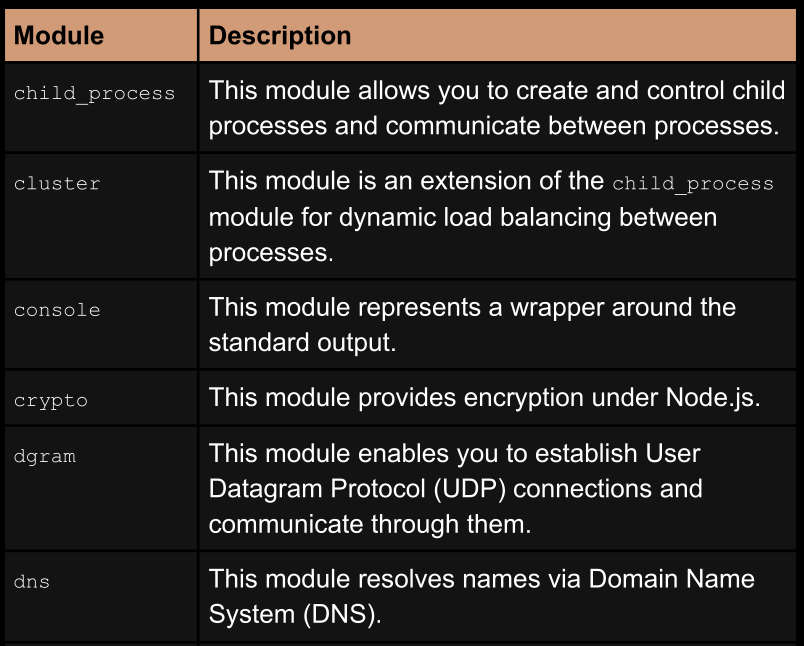
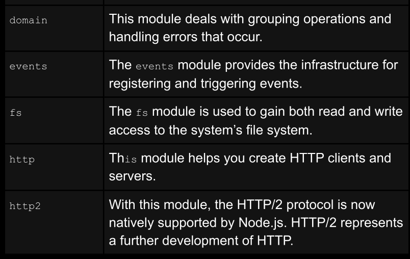
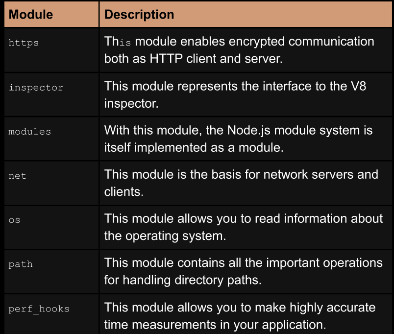
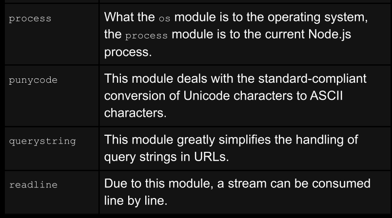
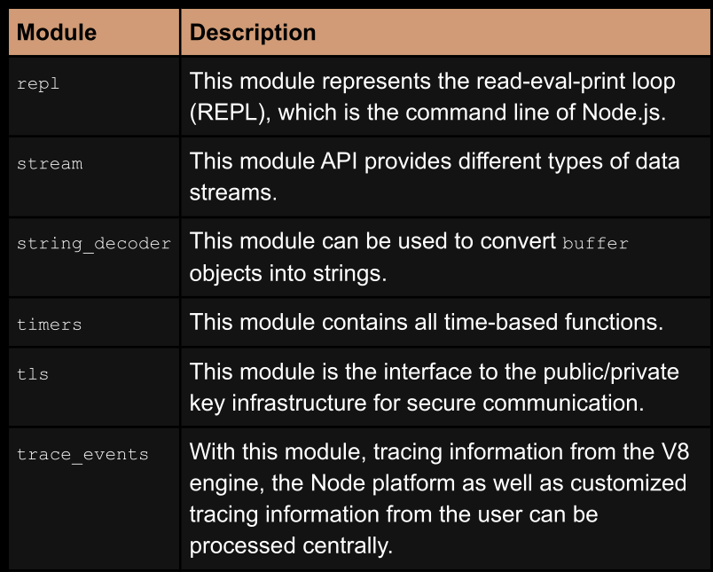
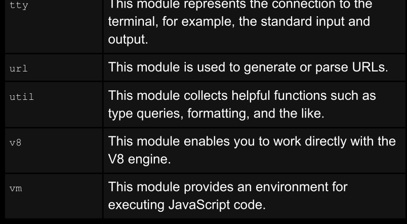
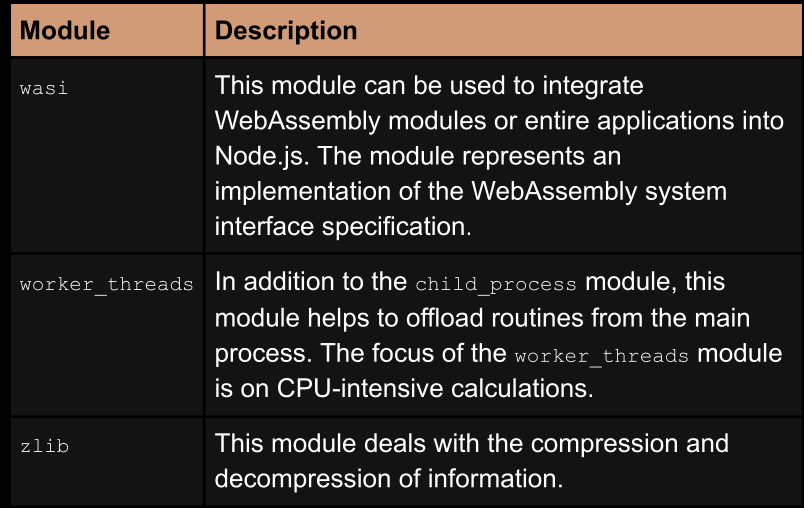
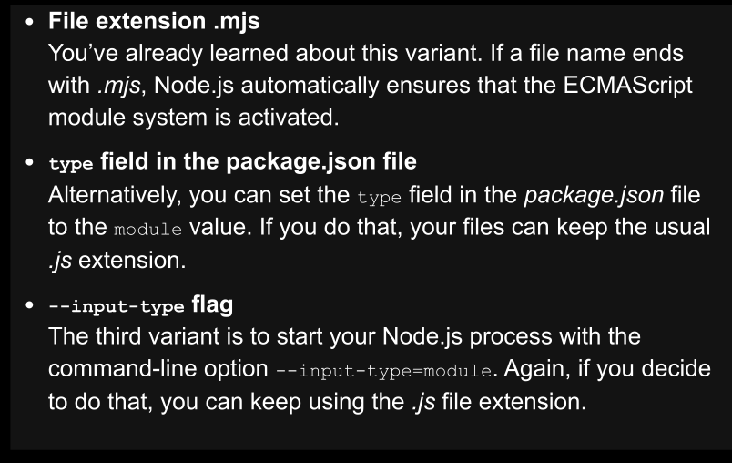
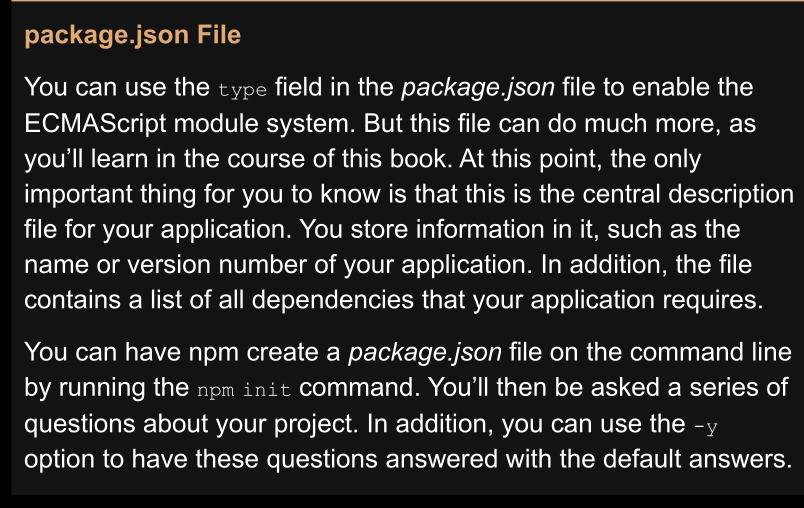

### start with ch4 because ch3 is just not imprtaont for me at this point


## the Node core modules










<hr/>

### original module system in Node.js is CommonJS
```javascript
// Loading the entire module
const os = require('os');
console.log(os.uptime());
// Loading the module and extracting certain functions by means of destructuring
const { uptime } = require('os');
console.log(uptime());

'''


<hr/>


### ES6 modules
```javascript
'''javascript

import os from 'os';
console.log(os.uptime());

import { uptime } from 'os';
console.log(uptime());
'''

<hr/>

### very good point here mention the different between the require and import 

### require is a function that loads a module and returns its exports
### import is a statement that tells the JavaScript engine to load a module 
### and make its exports available in the current scope

### we can use require without any extra configuration
### but we need to use in out package.json file "type": "module" to use import
### or to use .mjs file extension

<hr/>

 

 


