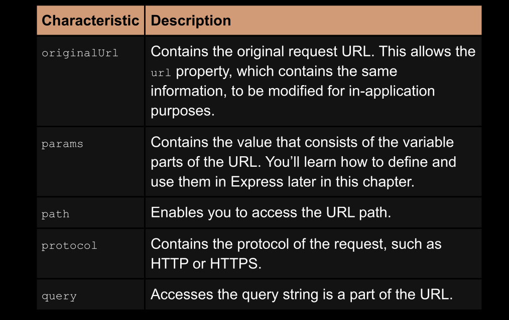
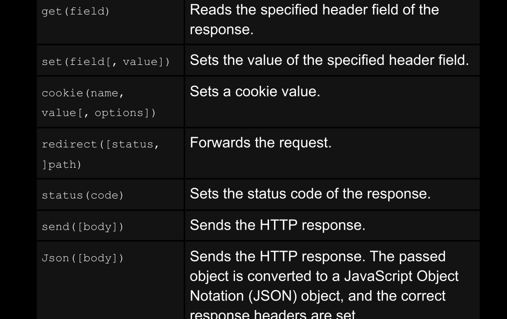
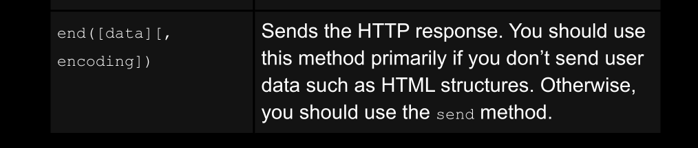

##  Express.js the imprtant parts

### simple express app

```js

import express from "express";
let app = express();
app.get("/", (req, res) => {
	res.send("<h1> Wlecome to your first express app </h1>");
	console.log(req.originalUrl); //  "/"
	console.log(req.method); // "GET"
	console.log(req.params);  // {}
	console.log(req.path); // "/"
	console.log(req.protocol); // "http"
	console.log(req.query); // {}
});
app.listen(8080, () => {
	console.log(" Movie data base is on http://localhost:8080");
});

```
## see `express_Req_methods 1 and 2`




## see `express_Res_methods 1 and 2`





